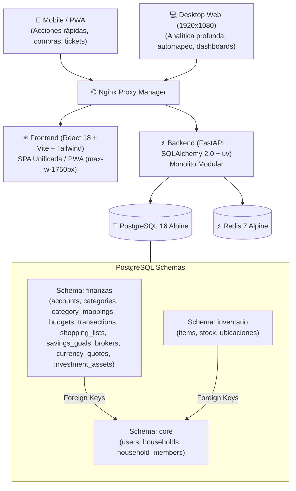

# 🏛️ Visión General de Arquitectura: `myp-apps`

`myp-apps` es una suite de gestión interna orientada a la administración del hogar, finanzas en pareja e inventario. Está estructurada como un **Monolito Modular** diseñado para ejecutarse eficientemente en contenedores con bajo consumo de memoria (< 280MB de RAM en una Raspberry Pi 5).

---

## 🧭 Diagrama de Arquitectura



---

## 📂 Estructura de Directorios

```text
myp-apps/
├── backend/
│   ├── app/
│   │   ├── core/                  # Configuración, DB async engine, seguridad y JWT
│   │   │   ├── config.py
│   │   │   ├── database.py        # Sesión async y auto-creación de esquemas
│   │   │   └── security.py        # Hashing bcrypt, PIN y JWT
│   │   ├── modules/
│   │   │   ├── core/              # Módulo de Identidad y Hogar
│   │   │   │   ├── models.py      # User, Household, HouseholdMember (schema: core)
│   │   │   │   ├── schemas.py     # UserOut, UserUpdate, HouseholdOut
│   │   │   │   ├── service.py     # Lógica de auth, switch de PIN, avatar colors y hogar
│   │   │   │   └── router.py      # /api/v1/auth & /api/v1/core
│   │   │   ├── finanzas/          # Módulo de Finanzas Personales y de Pareja
│   │   │   │   ├── models.py      # Accounts, Categories, CategoryMappings, Transactions, etc.
│   │   │   │   ├── schemas.py     # Schemas Pydantic v2
│   │   │   │   ├── service.py     # Lógica Splitwise 50/50, CSV, automapeo, liquidaciones
│   │   │   │   └── router.py      # /api/v1/finanzas/*
│   │   │   └── inventario/        # Módulo de Inventario del Hogar
│   │   ├── shared/                # Modelos base declarativos, mixins y excepciones
│   │   └── main.py                # Entrada FastAPI, middlewares CORS y montaje de routers
│   ├── migrations/                # Migraciones Alembic multi-esquema
│   ├── tests/                     # Suite de pruebas Pytest (100% pasando, 10 tests)
│   ├── pyproject.toml             # uv dependencies, ruff, pytest
│   └── Dockerfile                 # Multi-stage Python 3.12 Slim
│
├── frontend/
│   ├── src/
│   │   ├── components/            # UI Kit y layouts (Navbar con switch rápido, Sidebar, BottomNav)
│   │   ├── context/               # AuthContext (login, JWT, switch de PIN)
│   │   ├── modules/
│   │   │   ├── core/pages/        # LoginPage, HogarPage (CRUD Categorías, Automapeo, Avatar Colors)
│   │   │   ├── finanzas/pages/    # FinanzasDashboard (Imputación 50/50, Reintegros inline, BarCharts), MovimientosPage
│   │   │   └── inventario/pages/  # InventarioPage
│   │   ├── services/api.ts        # Axios con interceptores de token y endpoints fuertemente tipados
│   │   ├── types/index.ts         # Tipos TypeScript compartidos
│   │   └── App.tsx                # Rutas protegidas y layout (max-w-[1750px])
│   ├── package.json               # pnpm dependencies
│   ├── vite.config.ts             # Vite 5 + Tailwind + VitePWA
│   └── Dockerfile                 # Multi-stage Node 22 Alpine + Nginx Alpine
│
├── docs/                          # Documentación del sistema
├── docker-compose.yml             # Postgres + Redis + Backend + Frontend
├── CONTEXT.md                     # Glosario de Lenguaje Ubicuo del Dominio
└── AGENTS.md                      # Contexto del Agente Antigravity
```

---

## 🗄️ Esquemas de Base de Datos (PostgreSQL)

1. **`core`**:
   - `users`: Identidad, email único, `hashed_password`, `pin_hash` (para switch ágil de perfil en dispositivos compartidos), nombre, `color_avatar` (configurable desde `HogarPage.tsx`), estado activo.
   - `households`: Espacio compartido del hogar ("Casa Pablo & Martu"), moneda principal (`ARS`/`USD`).
   - `household_members`: Asociación de usuarios a hogares con roles `ADMIN` y `MEMBER`.

2. **`finanzas`**:
   - `accounts`: Cuentas y billeteras 100% personales (bancos, fintechs, efectivo, crypto).
   - `categories`: Clasificación ortogonal (`FIXED_HOUSEHOLD`, `VARIABLE_HOUSEHOLD`, `LEISURE_COUPLE`, `FIXED_PERSONAL`, `VARIABLE_PERSONAL`) y bloque de color identificador.
   - `category_mappings`: Reglas de automapeo inteligente por palabras clave (`patron`, `category_id`) con soporte CRUD completo (`GET`, `POST`, `PUT`, `DELETE`).
   - `budgets`: Presupuestos mensuales por categoría (`month`, `year`, `monto_limite`).
   - `transactions`: Movimientos financieros con discriminación de gastos compartidos 50/50 y liquidaciones (`SETTLEMENT`).
   - `shopping_lists` & `shopping_items`: Listas de compras con descuento general de carrito y descuentos específicos por producto.
   - `savings_goals` & `goal_contributions`: Metas de ahorro y aportes registrados (con desvinculación de cuentas bancarias).
   - `brokers` & `broker_transactions`: Plataformas de inversión (saldos en ARS, USD y Crypto).
   - `currency_quotes`: Registro histórico de cotizaciones de divisas y criptoactivos (`USD_MEP`, `USD_BLUE`, `USDT`, `BTC`).
   - `investment_assets`: Títulos, CEDEARs, Acciones y Fondos Comunes de Inversión con rendimiento esperado mensual/anual.

3. **`inventario`**:
   - Reservado para el control de stock, despensa y activos del hogar.
